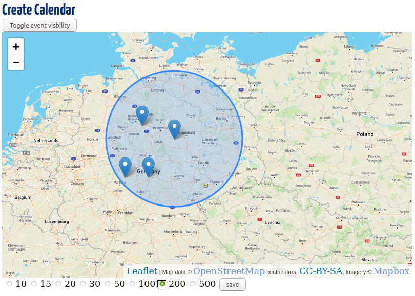

# Apache Wicket Example 
This is an example app using Apache wicket for educational purpose.
## More than a quickstart
This app is based on the Wicket quickstart app. With a few modifications/additions:
* Annotations instead of xml files
    * no web.xml
    * no beans.xml
* Use SpringFramework as IoC
* Use Apache Derby via Hibernate, configured via Spring
    * Used as in-memory database with an initial dataset
* Create a custom component for geographic map interaction
    * Use Leaflet map with OpenStreetMap data and MapBox tiles
    * A location picker as FormComponent
    * Integrate geo map with AJAX callbacks
* Use an inherited page layout
    * Add navigation sidebar
* Use spotbugs to identify bugs
## Run it
    mvn jetty:run
### Sceenshot

### MapBox tiles
The app should work out of the box, but the interactive map will be blank. To access MapBox tiles an access token is required, which can be requested [here](https://www.mapbox.com/studio/account/tokens/) for free. Otherwise the map will stay blank.

Place the token in src/main/resources/app.properties:
                 
    mapbox_token=pk.iASDFNJVCeLsvdFbRdNhjkJKSDgkhjFkgGjkKAlSNlD79lGlKSDNF34KSDFNasdf.ASDrtFGBsdVERfgGSDFhGX
